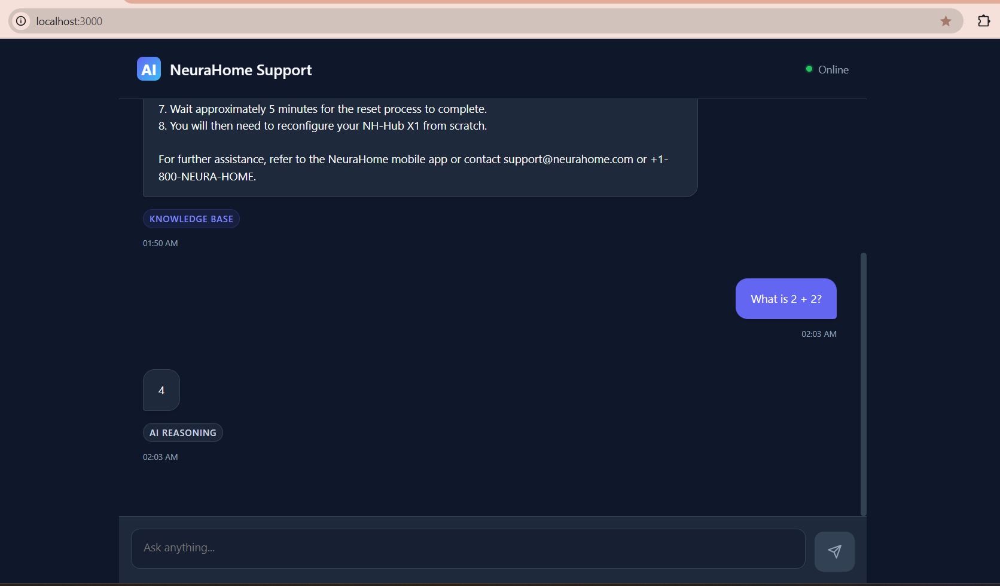
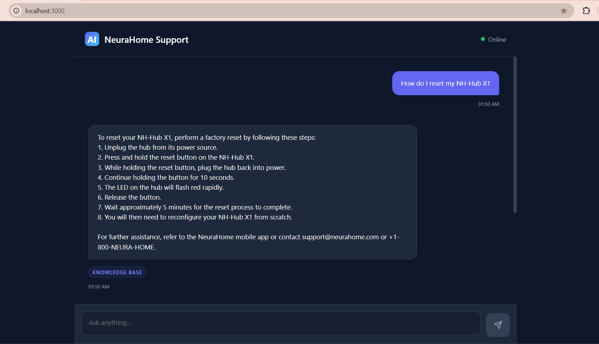

<h1 align="center">NeuraHome AI Customer Support</h1>

<div align="center">


**An intelligent AI-powered customer support system with RAG (Retrieval-Augmented Generation) capabilities, powered by LangChain agents**

[Features](#features) • [Quick Start](#quick-start) • [Documentation](#documentation) • [API Reference](#api-reference)

</div>

---

## Table of Contents

- [Overview](#overview)
- [Screenshots](#screenshots)
- [Features](#features)
- [Tech Stack](#tech-stack)
- [Architecture](#architecture)
- [Prerequisites](#prerequisites)
- [Installation](#installation)
- [Configuration](#configuration)
- [Running the Application](#running-the-application)
- [API Reference](#api-reference)
- [Project Structure](#project-structure)
- [Environment Variables](#environment-variables)
- [Testing](#testing)
- [Deployment](#deployment)
- [Contributing](#contributing)
- [License](#license)

---

## Overview

NeuraHome AI Customer Support is a comprehensive customer support system that leverages advanced AI technologies to provide intelligent, context-aware assistance. The system combines Retrieval-Augmented Generation (RAG) with LangChain agents to deliver accurate responses from product documentation, FAQs, and troubleshooting guides.

### Key Capabilities

- **Intelligent Query Routing**: Automatically determines whether to use RAG retrieval or direct LLM reasoning
- **Conversation Memory**: Maintains context across multiple interactions using Redis
- **Multi-Tool Support**: Integrates order lookup, ticket creation, and address management
- **Source Attribution**: Provides citations and source references for transparency
- **Modern Web Interface**: Beautiful, responsive Next.js frontend

---

## Screenshots

<div align="center">

### Application Interface


*Main chat interface with conversation history*



*Interactive features and response display*



*Source attribution and tool indicators*

</div>

---

## Features

### Core Features

- **Intelligent Agent System**: LangChain ReAct agent that intelligently routes queries
- **RAG-Powered Knowledge Base**: Vector search over product manuals, FAQs, and policies
- **Conversational Memory**: Maintains conversation context across sessions
- **Source Attribution**: Shows which documents were used to generate answers
- **Multi-Tool Integration**: 
  - Order lookup and tracking
  - Support ticket creation
  - Address management
- **Modern UI**: Clean, responsive chat interface built with Next.js
- **Health Monitoring**: Built-in health check endpoints
- **Session Management**: Secure session handling with UUID-based identifiers

### Knowledge Base Coverage

- Product Manuals (Smart Bulbs, Cameras, Hubs, Door Locks)
- Troubleshooting Guides (Network, Connectivity, Pairing Issues)
- Policy Documents (Privacy, Returns, Shipping, Warranty)
- FAQ Sections (Account, Device, Orders, Payments)
- Advanced Settings Guides

---

## Tech Stack

### Backend

- **Framework**: FastAPI 0.110.0
- **AI/ML**:
  - LangChain 0.3.7
  - Google Gemini 2.5 Flash
  - Sentence Transformers
- **Vector Database**: FAISS
- **Memory**: Redis 5.0.1
- **Server**: Uvicorn 0.30.1

### Frontend

- **Framework**: Next.js 16.0.6
- **Language**: TypeScript 5
- **UI**: React 19.2.0
- **Styling**: CSS Modules

### Data Processing

- **Embeddings**: Sentence Transformers
- **Text Splitting**: LangChain Text Splitters
- **Storage**: JSON files for orders, tickets, users

---

## Architecture

```
┌─────────────────┐
│   Next.js UI    │
│   (Frontend)    │
└────────┬────────┘
         │ HTTP/REST
         ▼
┌─────────────────┐
│   FastAPI       │
│   (Backend)     │
└────────┬────────┘
         │
    ┌────┴────┐
    │         │
    ▼         ▼
┌────────┐ ┌──────────┐
│  RAG   │ │  Agent   │
│ System │ │ Executor │
└───┬────┘ └────┬─────┘
    │          │
    ▼          ▼
┌────────┐ ┌──────────┐
│ FAISS  │ │  Tools   │
│ Vector │ │ (Orders, │
│ Store  │ │ Tickets)  │
└────────┘ └──────────┘
    │
    ▼
┌─────────────┐
│  Redis      │
│  (Memory)   │
└─────────────┘
```

---

## Prerequisites

Before you begin, ensure you have the following installed:

- **Python**: 3.8 or higher
- **Node.js**: 18.0 or higher
- **npm** or **yarn**: Latest version
- **Redis**: 5.0+ (optional, for conversation memory)
- **Google API Key**: For Gemini AI access

---

## Installation

### 1. Clone the Repository

```bash
git clone <repository-url>
cd customer_support_ai
```

### 2. Backend Setup

```bash
# Create virtual environment
python -m venv venv

# Activate virtual environment
# On Windows:
venv\Scripts\activate
# On macOS/Linux:
source venv/bin/activate

# Install dependencies
pip install -r requirements.txt
```

### 3. Frontend Setup

```bash
cd frontend
npm install
```

---

## Configuration

### Backend Environment Variables

Create a `.env` file in the project root:

```env
# Required: Google Gemini API Key
GOOGLE_API_KEY=your_google_api_key_here
# OR
GEMINI_API_KEY=your_google_api_key_here

# Optional: Redis Configuration (for conversation memory)
REDIS_URL=redis://localhost:6379/0
RAG_MEMORY_MAX_HISTORY=10
RAG_MEMORY_TTL=604800
```

### Frontend Environment Variables

Create `frontend/.env.local` (optional):

```env
NEXT_PUBLIC_API_URL=http://localhost:8000
```

**Note**: If not set, the frontend defaults to `http://localhost:8000`

---

## Running the Application

### Development Mode

#### Start Backend

```bash
# Activate virtual environment first
uvicorn app.main:app --host 0.0.0.0 --port 8000 --reload
```

Or run directly:

```bash
python app/main.py
```

#### Start Frontend

```bash
cd frontend
npm run dev
```

### Production Mode

#### Build Frontend

```bash
cd frontend
npm run build
npm start
```

#### Run Backend

```bash
uvicorn app.main:app --host 0.0.0.0 --port 8000
```

### Access Points

- **Frontend**: http://localhost:3000
- **Backend API**: http://localhost:8000
- **API Documentation**: http://localhost:8000/docs
- **Alternative Docs**: http://localhost:8000/redoc
- **Health Check**: http://localhost:8000/health

---

## API Reference

### Base URL

```
http://localhost:8000
```

### Endpoints

#### Health Check

```http
GET /health
```

**Response:**
```json
{
  "status": "ok",
  "message": "Service is healthy",
  "api_key_configured": true
}
```

#### Ask Question (POST)

```http
POST /ask
Content-Type: application/json

{
  "question": "How do I pair my smart bulb?",
  "k": 5,
  "include_sources": true
}
```

**Response:**
```json
{
  "answer": "To pair your smart bulb...",
  "sources": [
    {
      "title": "Bulb Pairing Guide",
      "score": 0.95,
      "category": "product_manuals",
      "source_file": "nh_bulb_glow_rgb_manual.md",
      "section": "Pairing"
    }
  ]
}
```

#### Agent Ask (POST)

```http
POST /agent/ask
Content-Type: application/json

{
  "session_id": "user-123-session",
  "question": "My bulb won't connect to the hub",
  "k": 5,
  "force_rag": null
}
```

**Response:**
```json
{
  "session_id": "user-123-session",
  "message": "My bulb won't connect to the hub",
  "answer": "Here's how to troubleshoot...",
  "sources": [...],
  "tool_used": "rag"
}
```

#### Chat Message (POST)

```http
POST /chat/message
Content-Type: application/json

{
  "session_id": "conversation-456",
  "message": "What's your return policy?",
  "k": 5
}
```

### Interactive API Documentation

Visit `http://localhost:8000/docs` for interactive Swagger UI documentation where you can test all endpoints directly.

---

## Project Structure

```
customer_support_ai/
├── app/                          # Backend application
│   ├── agent/                    # LangChain agent implementation
│   │   └── support_agent.py      # Main agent with ReAct logic
│   ├── api/                      # API routes
│   │   ├── routes.py             # API router
│   │   └── ask.py                # Agent ask endpoint
│   ├── chat/                     # Chat chain implementation
│   │   └── chat_chain.py
│   ├── memory/                   # Conversation memory
│   │   └── memory.py             # Redis-based memory store
│   ├── rag/                      # RAG system
│   │   ├── chunker.py            # Text chunking
│   │   ├── embedder.py           # Embedding generation
│   │   ├── loader.py             # Document loading
│   │   ├── query_engine.py       # Query processing
│   │   ├── rag_chain.py          # RAG chain implementation
│   │   └── vector_store.py       # FAISS vector store
│   ├── routes/                   # Additional routes
│   │   └── chat_router.py        # Chat router
│   ├── tools/                    # Agent tools
│   │   ├── order_tool.py         # Order lookup tool
│   │   ├── ticket_tool.py        # Ticket creation tool
│   │   └── user_tool.py          # User management tool
│   ├── utils/                    # Utilities
│   │   └── logger.py             # Logging configuration
│   └── main.py                   # FastAPI application entry point
│
├── frontend/                     # Next.js frontend
│   ├── src/
│   │   ├── app/                  # Next.js app directory
│   │   │   ├── layout.tsx        # Root layout
│   │   │   └── page.tsx          # Home page
│   │   ├── components/           # React components
│   │   │   ├── ChatInterface.tsx
│   │   │   ├── MessageBubble.tsx
│   │   │   ├── InputArea.tsx
│   │   │   ├── TypingIndicator.tsx
│   │   │   ├── SourceList.tsx
│   │   │   └── ToolIndicator.tsx
│   │   ├── lib/                  # Utilities
│   │   │   ├── api.ts            # API client
│   │   │   └── session.ts        # Session management
│   │   └── types/                # TypeScript types
│   │       └── api.ts
│   ├── public/                   # Static assets
│   └── package.json
│
├── data/                         # Data files
│   ├── knowledge_base/           # Knowledge base documents
│   │   ├── faqs/                 # FAQ documents
│   │   ├── policy_documents/     # Policy documents
│   │   ├── product_manuals/      # Product manuals
│   │   └── troubleshooting_guides/ # Troubleshooting guides
│   ├── embeddings.npy            # Pre-computed embeddings
│   ├── faiss_index.bin           # FAISS vector index
│   ├── metadata.jsonl            # Document metadata
│   ├── orders.json               # Order data
│   ├── tickets.json              # Ticket data
│   └── users.json                # User data
│
├── requirements.txt              # Python dependencies
├── .gitignore                    # Git ignore rules
└── README.md                     # This file
```

---

## Environment Variables

### Backend

| Variable | Required | Default | Description |
|----------|----------|---------|-------------|
| `GOOGLE_API_KEY` | Yes* | - | Google Gemini API key |
| `GEMINI_API_KEY` | Yes* | - | Alternative API key variable |
| `REDIS_URL` | No | `redis://localhost:6379/0` | Redis connection URL |
| `RAG_MEMORY_MAX_HISTORY` | No | `10` | Max conversation history length |
| `RAG_MEMORY_TTL` | No | `604800` | Session TTL in seconds (7 days) |

*At least one API key is required

### Frontend

| Variable | Required | Default | Description |
|----------|----------|---------|-------------|
| `NEXT_PUBLIC_API_URL` | No | `http://localhost:8000` | Backend API URL |

---

## Testing

### Backend Testing

```bash
# Run health check
curl http://localhost:8000/health

# Test ask endpoint
curl -X POST http://localhost:8000/ask \
  -H "Content-Type: application/json" \
  -d '{"question": "How do I pair my bulb?", "include_sources": true}'
```

### Frontend Testing

The frontend can be tested by:
1. Starting both backend and frontend servers
2. Opening http://localhost:3000
3. Sending test messages through the chat interface

### Using Postman

See the API documentation at `/docs` for detailed endpoint specifications. You can also import the OpenAPI schema from `/openapi.json`.

---

## Deployment

### Backend Deployment

1. Set environment variables on your hosting platform
2. Install dependencies: `pip install -r requirements.txt`
3. Run with production server:
   ```bash
   uvicorn app.main:app --host 0.0.0.0 --port 8000 --workers 4
   ```

### Frontend Deployment

1. Build the application:
   ```bash
   cd frontend
   npm run build
   ```

2. Set `NEXT_PUBLIC_API_URL` to your production backend URL

3. Deploy to Vercel, Netlify, or your preferred platform

### Production Considerations

- **CORS**: Update `allow_origins` in `app/main.py` to restrict allowed origins
- **API Keys**: Use secure environment variable management
- **Redis**: Set up production Redis instance for conversation memory
- **Monitoring**: Add logging and monitoring solutions
- **Rate Limiting**: Implement rate limiting for API endpoints
- **HTTPS**: Use HTTPS in production

---

## Contributing

Contributions are welcome! Please follow these steps:

1. Fork the repository
2. Create a feature branch (`git checkout -b feature/amazing-feature`)
3. Commit your changes (`git commit -m 'Add some amazing feature'`)
4. Push to the branch (`git push origin feature/amazing-feature`)
5. Open a Pull Request

### Development Guidelines

- Follow PEP 8 for Python code
- Use TypeScript for frontend code
- Write clear commit messages
- Add tests for new features
- Update documentation as needed

---

## License

This project is licensed under the MIT License - see the LICENSE file for details.

---

## Support

For issues, questions, or contributions, please open an issue on the GitHub repository.

---

## Acknowledgments

- [LangChain](https://www.langchain.com/) for the agent framework
- [FastAPI](https://fastapi.tiangolo.com/) for the web framework
- [Next.js](https://nextjs.org/) for the frontend framework
- [Google Gemini](https://ai.google.dev/) for the AI model

---

<div align="center">

**Built with passion for intelligent customer support**

</div>
